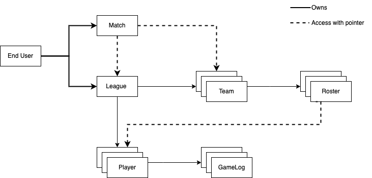
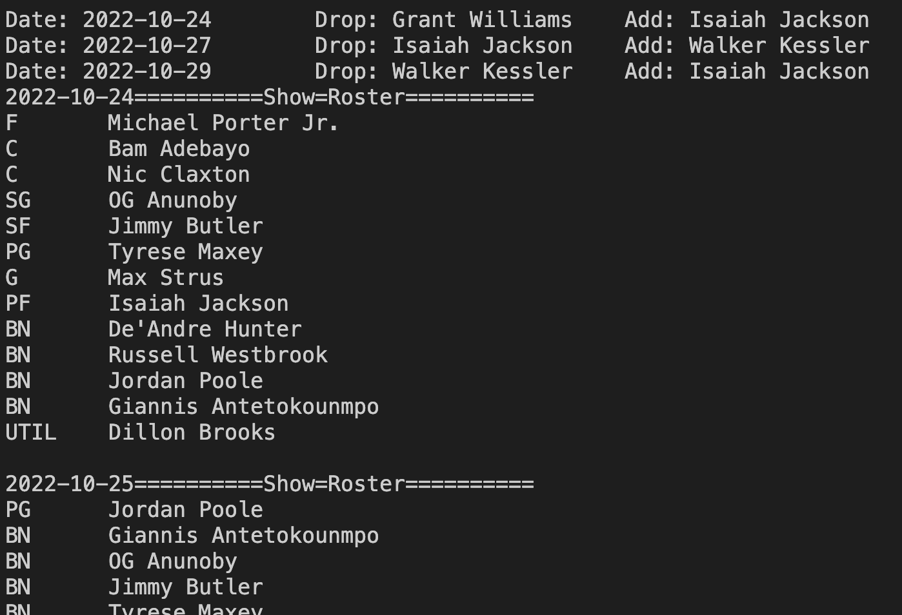
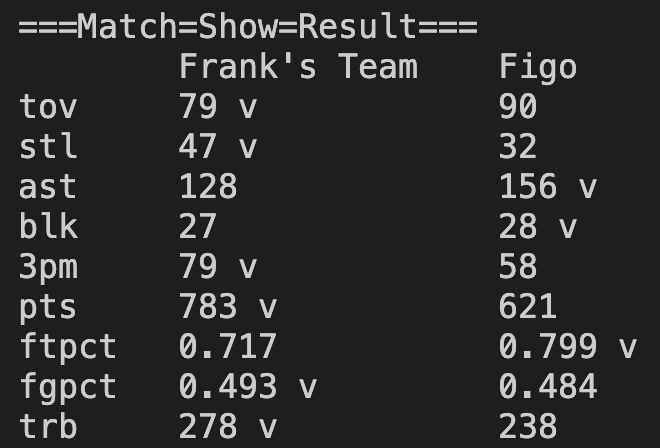

# Fantasy Optimizer Manual

## Class Diagram



## Tutorial

The file ```test.cpp``` is the best example of how to use our Fantasy Optimizer.

### Choose the date and create a league
```c++
League::League(std::string dateString);
```
Arguments:
- ```dateString```: the current date of the league, in the format of YYYY-MM-DD

``` c++
std::string currDate = "2022-10-24";
League::League testLeague(currDate);
```

### Add teams
```c++
void League::addTeam(std::string teamName);
```
Arguments:
- ```teamName```: team name

``` c++
testLeague.addTeam("Frank's Team");
testLeague.addTeam("Figo");
```

### Add players to a team's roster
```c++
bool League::teamSetPlayerPlacement(int teamNo, std::unordered_map<std::string, std::unordered_set<std::string>> newPlacementId);
```
Arguments:
- ```teamNo```: team id
- ```newPlacementId```: a mapping of position strings to sets of player id's

Position strings:
- "BN": Bench
- "PG": Point Guard
- "SG": Sooting Guard
- "SF": Small Forward
- "PF": Power Forward
- "C": Center
- "G": Guard
- "F": Forward
- "UTIL": Utility

``` c++
// place every player to the bench
std::unordered_map<std::string, std::unordered_set<std::string>> myPlacement {
    {"BN", std::unordered_set<std::string>{"poolejo01", "maxeyty01", "claxtni01",
                                            "antetgi01", "butleji01", "huntede01",
                                            "brookdi01", "portemi01", "willigr01",
                                            "adebaba01", "westbru01", "anunoog01",
                                            "strusma01", 
                                            }}
};

std::unordered_map<std::string, std::unordered_set<std::string>> figoPlacement {
    {"BN", std::unordered_set<std::string>{"paulch01", "jacksre01", "simonan01",
                                            "georgpa01", "haywago01", "valanjo01",
                                            "herroty01", "hartjo01", "carusal01",
                                            "porteke02", "robinmi01", "garubus01",
                                            "embiijo01"
                                            }}
};
```

```c++
testLeague.teamSetPlayerPlacement(0, myPlacement);
testLeague.teamSetPlayerPlacement(1, figoPlacement);
```

### Create a matchup and duplicate Monday's roster for the whole week
```c++
Match::Match(std::string myTeamName, std::string oppoTeamName, League::League* league);
```
Arguments:
- ```myTeamName```: my team name
- ```oppoTeamName```: opponent's team name
- ```league```: pointer to the league

``` c++
Match::Match newMatch("Frank's Team", "Figo", &testLeague);
newMatch.createWeekRosterBaseOnMonday();
```

### Add free agents to my watchlist
```c++
void League::teamAddPlayerToWatchList(int teamNo, std::string playerId);
```
Arguments:
- ```teamNo```: team id
- ```playerId```: player id

``` c++
testLeague.teamAddPlayerToWatchList(0, "nesmiaa01");
testLeague.teamAddPlayerToWatchList(0, "jacksis01");
testLeague.teamAddPlayerToWatchList(0, "kesslwa01");
```

### Find the best roster using optimizers
```c++
void Match::applyOptimizer(std::chrono::sys_days startDate, Optimizer::BaseOptimizer* optimizer);
void Match::applyOptimizer(std::chrono::sys_days startDate, Optimizer::BaseOptimizer* myOptimizer, Optimizer::BaseOptimizer* oppoOptimizer);
```
Arguments:
- ```startDate```: starting date of the week's game
- ```optimizer```: pointer to an optimizer
- ```myOptimizer```: pointer to an optimizer used to optimize my team's roster
- ```oppoOptimizer```: pointer to an optimizer used to optimize opponent team's roster

The first function doesn't do optimization for the opponent; the second one takes an additional argument of opponent's optimizer against which we optimize for.

Currently there are three optimizers available:
- ```StupidOptimizer```: place as many players as possible
- ```GreedyOptimizer```: only consider players playing today and place best players first (based on scoring  system)
- ```StreamOptimizer```: drop the worst player (based on our prediction) and pick the best substitution from our watchlist

``` c++
// print daily roster suggestion and add/drop suggestion
Optimizer::GreedyOptimizer greedyOptimizer(&newMatch); // my optimizer
Optimizer::StreamOptimizer streamOptimzer(&newMatch); // opponent's optimizer
newMatch.applyOptimizer(currDate, &streamOptimzer, &greedyOptimizer);
// suppose opponent's strategy is greedy, optimize our roster against it
```


### Show result
``` c++
// print the final result
newMatch.showResults();
```


Category strings:
- "fgm": Field Goal Made
- "fgpct": Field Goal Percentage
- "ftm": Free Throw Made
- "ftpct": Free Throw Percentage
- "3pm": Three-point Field Goal Made
- "3pmpct": Three-point Field Goal Percentage
- "pts": Point
- "astor": Assist to Turnover Ratio
- "drb": Defensive Rebound
- "orb": Offence Rebound
- "trb": Total Rebound
- "ast": Assist
- "stl": Steal
- "blk": Block
- "tov": Turnover
- "dd": Double Double
